# 自然语言处理

## 一、词嵌入（word2vec）

自然语言是一套用来表达含义的复杂系统。在这套系统中，词是表义的基本单元。顾名思义，词向量是用来表示词的向量，也可被认为是词的特征向量或表征。把词映射为实数域向量的技术也叫词嵌入（word embedding）。近年来，词嵌入已逐渐成为自然语言处理的基础知识。

### 1、为何不采用one-hot向量

one-hot词向量无法准确表达不同词之间的相似度

Word2Vec 词嵌入工具的提出正是为了解决上面这个问题，它将每个词表示成一个定长的向量，并通过在语料库上的预训练使得这些向量能较好地表达不同词之间的相似和类比关系，以引入一定的语义信息。

word2vec工具包含了两个模型，即跳字模型（skip-gram）和连续词袋模型（continuous bag of words，CBOW）。接下来让我们分别介绍这两个模型以及它们的训练方法。

### 2、跳字模型

跳字模型假设基于某个词来生成它在文本序列周围的词。举个例子，假设文本序列是“the”“man”“loves”“his”“son”。以“loves”作为中心词，设背景窗口大小为2。如图10.1所示，跳字模型所关心的是，给定中心词“loves”，生成与它距离不超过2个词的背景词“the”“man”“his”“son”的条件概率，即

$$P(\textrm{the"},\textrm{man"},\textrm{his"},\textrm{son"}\mid\textrm{``loves"}).$$

假设给定中心词的情况下，背景词的生成是相互独立的，那么上式可以改写成

$$P(\textrm{the"}\mid\textrm{loves"})\cdot P(\textrm{man"}\mid\textrm{loves"})\cdot P(\textrm{his"}\mid\textrm{loves"})\cdot P(\textrm{son"}\mid\textrm{loves"}).$$

训练结束后，对于词典中的任一索引为i的词，我们均得到该词作为中心词和背景词的两组词向量vi和ui。在自然语言处理应用中，一般使用跳字模型的中心词向量作为词的表征向量。

 **2.1、训练跳字模型**

训练跳词模型的主要步骤：
* PTB 数据集

**1、载入数据集**

**2、建立词语索引**

**3、二次采样**

文本数据中一般会出现一些高频词，如英文中的“the”“a”和“in”。通常来说，在一个背景窗口中，一个词（如“chip”）和较低频词（如“microprocessor”）同时出现比和较高频词（如“the”）同时出现对训练词嵌入模型更有益。因此，训练词嵌入模型时可以对词进行二次采样。 具体来说，数据集中每个被索引词  wi  将有一定概率被丢弃，该丢弃概率为

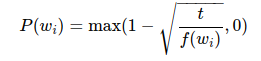

其中  f(wi)  是数据集中词  wi  的个数与总词数之比，常数  t  是一个超参数（实验中设为  10−4 ）。可见，只有当  f(wi)>t  时，我们才有可能在二次采样中丢弃词  wi ，并且越高频的词被丢弃的概率越大。

**4、提取中心词和背景词**

* Skip-Gram 跳字模型

在跳字模型中，每个词被表示成两个  d  维向量，用来计算条件概率。假设这个词在词典中索引为  i  ，当它为中心词时向量表示为  vi∈Rd ，而为背景词时向量表示为  ui∈Rd  。设中心词  wc  在词典中索引为  c ，背景词  wo  在词典中索引为  o ，我们假设给定中心词生成背景词的条件概率满足下式：

对于神经概率语言模型，缺点主要是计算量太大，集中在：『隐层和输出层之间的矩阵运算』和『输出层上的Softmax归一化运算』上。因此Word2vec就是针对这两点来优化神经概率语言模型的。
首先，Word2vec选择将输入层到投影层的运算从『拼接』变成『叠加』。也就是说，投影层的节点数不再是上下文词数量*词向量维度，而就是词向量维度。
其次，针对『隐层和输出层之间的矩阵运算』，word2vec选择删去隐藏层。

上述式子的计算瓶颈在于分母。分母需要枚举一遍词典中所有的词，而词典中的词的数目在的量级。看起来是不多，但是要注意，我们需要对语料库中的每个词进行训练并按照公式计算，而语料库中的词的数量级通常在million甚至billion量级，这样一来的话，训练复杂度就无法接受。

因此，Word2vec提出了两种优化Softmax计算过程的方法，同样也对应着Word2vec的两种框架，即：Hieraichical Softmax和Negative Sampling。

**1、Hieraichical Softmax**

本框架之所以叫『Hierarchical Softmax』，就是它利用了树实现了分层的Softmax，即用树形结构替代了输出层的结构。

Hierarchical softmax采用的树是二叉树。它将树上的叶子节点分配给词典里的词，而将从树根到叶子节点的路径上的每个非叶子结点都看作是二分类，路径上的二分类概率连乘的结果就是该叶子节点对应的词的概率。

一个full softmax需要一次计算所有的个词，而hierarchical softmax却只需要计算大约（即树根到该叶子节点的路径长度）个词，大大减少了计算的复杂度。

实际应用中，Hierarchical Softmax采用是Huffman树而不是其他的二叉树，这是因为Huffman树对于高频词会赋予更短的编码，使得高频词离根节点距离更近，从而使得训练速度加快。

**2、负采样近似（Negative Sampling）**

另一种可行的方法是。假定好的模型应该能够通过逻辑回归的方法从数据中区别出噪声。
Word2vec采用的Negative Sampling是NCE的一种简化版本，目的是为了提高训练速度以及改善所得词的质量。相比于Hierarchical Softmax，Negative Sampling不再采用Huffman树，而是采用随机负采样。

由于 softmax 运算考虑了背景词可能是词典  V  中的任一词，对于含几十万或上百万词的较大词典，就可能导致计算的开销过大。我们将以 skip-gram 模型为例，介绍负采样 (negative sampling) 的实现来尝试解决这个问题。

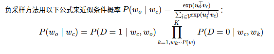

其中  P(D=1∣wc,wo)=σ(u⊤ovc) ， σ(⋅)  为 sigmoid 函数。对于一对中心词和背景词，我们从词典中随机采样  K  个噪声词（实验中设  K=5 ）。根据 Word2Vec 论文的建议，噪声词采样概率  P(w)  设为  w  词频与总词频之比的  0.75  次方。

其中是联合构成的词向量，对应的是的词向量。
我们要最大化，就相当于最大化分子，最小化分母。因为两个向量的点积越大，约等于两个向量相似度越高（cosine相似度）。所以，我们就是尽量最大化和的相似度，尽量最小化和相似度。
即最大化与当前词的词向量的相似度，最小化与非当前词的词向量的相似度。
我们可以将分子的看做一个正样本，将分母的看做负样本（因为它没在训练数据中出现过）。问题在于，上面公式将词典里的所有词都看做了负样本，因此计算分母太耗时间。所以，我们使用Negative Sampling的思路，每次只从词典里随机选一些word作为当前词的负样本（称为），而不是以所有的字典里的其他词作为负样本。

其实在做出随机选取负样本的动作之后，我们就已经抛弃了Softmax这个函数所代表的归一化的意思了。也就代表了我们已经不再关注求解语言模型的问题，而只关注求解词向量的问题。

* 训练模型

**1、读取数据**

我们从数据集中提取所有中心词all_centers，以及每个中心词对应的背景词all_contexts和噪声词all_negatives。

我们将通过随机小批量来读取它们。在一个小批量数据中，第i个样本包括一个中心词以及它所对应的ni个背景词和mi个噪声词。由于每个样本的背景窗口大小可能不一样，其中背景词与噪声词个数之和ni+mi也会不同。在构造小批量时，我们将每个样本的背景词和噪声词连结在一起，并添加填充项0直至连结后的长度相同，即长度均为maxini+mi（max_len变量）。为了避免填充项对损失函数计算的影响，我们构造了掩码变量masks，其每一个元素分别与连结后的背景词和噪声词contexts_negatives中的元素一一对应。当contexts_negatives变量中的某个元素为填充项时，相同位置的掩码变量masks中的元素取0，否则取1。为了区分正类和负类，我们还需要将contexts_negatives变量中的背景词和噪声词区分开来。依据掩码变量的构造思路，我们只需创建与contexts_negatives变量形状相同的标签变量labels，并将与背景词（正类）对应的元素设1，其余清0。

## 二、子词嵌入（fastText）

## 三、全局向量的词嵌入（GloVe）

将跳字模型中使用softmax运算表达的条件概率P(wj∣wi)记作qij，即

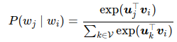

其中vi和ui分别是索引为i的词wi作为中心词和背景词时的向量表示，V=0,1,…,|V|−1为词典索引集。

对于词wi，它在数据集中可能多次出现。我们将每一次以它作为中心词的所有背景词全部汇总并保留重复元素，记作多重集（multiset）Ci。一个元素在多重集中的个数称为该元素的重数（multiplicity）。举例来说，假设词wi在数据集中出现2次：文本序列中以这2个wi作为中心词的背景窗口分别包含背景词索引2,1,5,2和2,3,2,1。那么多重集Ci=1,1,2,2,2,2,3,5，其中元素1的重数为2，元素2的重数为4，元素3和5的重数均为1。将多重集$\mathcal{C}i中元素j的重数记作x{ij}：它表示了整个数据集中所有以w_i为中心词的背景窗口中词w_j$的个数。那么，跳字模型的损失函数还可以用另一种方式表达：

我们将数据集中所有以词wi为中心词的背景词的数量之和记为x_i，并将以w_i为中心词生成背景词w_j的条件概率x{ij}/x_i记作p_{ij}$。我们可以进一步改写跳字模型的损失函数为

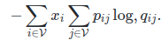

上式中计算的是以wi为中心词的背景词条件概率分布pij和模型预测的条件概率分布qij的交叉熵，且损失函数使用所有以词wi为中心词的背景词的数量之和来加权。最小化上式中的损失函数会令预测的条件概率分布尽可能接近真实的条件概率分布。

然而，作为常用损失函数的一种，交叉熵损失函数有时并不是好的选择。一方面，正如我们在10.2节（近似训练）中所提到的，令模型预测qij成为合法概率分布的代价是它在分母中基于整个词典的累加项。这很容易带来过大的计算开销。另一方面，词典中往往有大量生僻词，它们在数据集中出现的次数极少。而有关大量生僻词的条件概率分布在交叉熵损失函数中的最终预测往往并不准确。

### 3.1、GloVe模型

GloVe模型采用了平方损失，并基于该损失对跳字模型做了3点改动：

1.使用非概率分布的变量  p′ij=xij  和  q'ij=exp(u⊤jvi) ，并对它们取对数；

2.为每个词  wi  增加两个标量模型参数：中心词偏差项  bi  和背景词偏差项  ci ，松弛了概率定义中的规范性；

3.将每个损失项的权重  xi  替换成函数  h(xij) ，权重函数  h(x)  是值域在  [0,1]  上的单调递增函数，松弛了中心词重要性与  xi  线性相关的隐含假设；

综上，我们获得了 GloVe 模型的损失函数表达式：

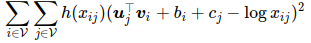

其中权重函数h(x)的一个建议选择是：当x<c时（如c=100），令h(x)=(x/c)α（如α=0.75），反之令h(x)=1。因为h(0)=0，所以对于xij=0的平方损失项可以直接忽略。当使用小批量随机梯度下降来训练时，每个时间步我们随机采样小批量非零xij，然后计算梯度来迭代模型参数。这些非零xij是预先基于整个数据集计算得到的，包含了数据集的全局统计信息。因此，GloVe模型的命名取“全局向量”（Global Vectors）之意。

需要强调的是，如果词wi出现在词wj的背景窗口里，那么词wj也会出现在词wi的背景窗口里。也就是说，xij=xji。不同于word2vec中拟合的是非对称的条件概率pij，GloVe模型拟合的是对称的log,xij。因此，任意词的中心词向量和背景词向量在GloVe模型中是等价的。但由于初始化值的不同，同一个词最终学习到的两组词向量可能不同。当学习得到所有词向量以后，GloVe模型使用中心词向量与背景词向量之和作为该词的最终词向量。

### 3.2、求近义词和类比词

**近义词：** 由于词向量空间中的余弦相似性可以衡量词语含义的相似性，我们可以通过寻找空间中的 k 近邻，来查询单词的近义词。

**类比词:** 除了求近义词以外，我们还可以使用预训练词向量求词与词之间的类比关系，例如“man”之于“woman”相当于“son”之于“daughter”。求类比词问题可以定义为：对于类比关系中的4个词“ a  之于  b  相当于  c  之于  d ”，给定前3个词  a,b,c  求  d 。求类比词的思路是，搜索与  vec(c)+vec(b)−vec(a)  的结果向量最相似的词向量，其中  vec(w)  为  w  的词向量。

## 四、文本情感分类

文本分类是自然语言处理的一个常见任务，它把一段不定长的文本序列变换为文本的类别。本节关注它的一个子问题：使用文本情感分类来分析文本作者的情绪。这个问题也叫情感分析，并有着广泛的应用。

同搜索近义词和类比词一样，文本分类也属于词嵌入的下游应用。在本节中，我们将应用预训练的词向量和含多个隐藏层的双向循环神经网络与卷积神经网络，来判断一段不定长的文本序列中包含的是正面还是负面的情绪。

### 4.1、文本情感分类：使用循环神经网络

### 4.2、文本情感分类：使用卷积神经网络（textCNN）

* **一维卷积层**

在介绍模型前我们先来解释一维卷积层的工作原理。与二维卷积层一样，一维卷积层使用一维的互相关运算。在一维互相关运算中，卷积窗口从输入数组的最左方开始，按从左往右的顺序，依次在输入数组上滑动。当卷积窗口滑动到某一位置时，窗口中的输入子数组与核数组按元素相乘并求和，得到输出数组中相应位置的元素。如图所示，输入是一个宽为 7 的一维数组，核数组的宽为 2。可以看到输出的宽度为 7−2+1=6，且第一个元素是由输入的最左边的宽为 2 的子数组与核数组按元素相乘后再相加得到的：0×1+1×2=2。

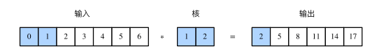

多输入通道的一维互相关运算也与多输入通道的二维互相关运算类似：在每个通道上，将核与相应的输入做一维互相关运算，并将通道之间的结果相加得到输出结果。下图展示了含 3 个输入通道的一维互相关运算，其中阴影部分为第一个输出元素及其计算所使用的输入和核数组元素：0×1+1×2+1×3+2×4+2×(−1)+3×(−3)=2。

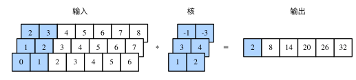

由二维互相关运算的定义可知，多输入通道的一维互相关运算可以看作单输入通道的二维互相关运算。如图所示，我们也可以将图中多输入通道的一维互相关运算以等价的单输入通道的二维互相关运算呈现。这里核的高等于输入的高。图中的阴影部分为第一个输出元素及其计算所使用的输入和核数组元素：2×(−1)+3×(−3)+1×3+2×4+0×1+1×2=2。

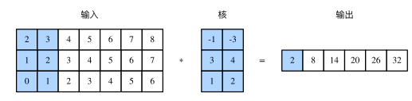

之前的例子中输出都只有一个通道。我们在“多输入通道和多输出通道”一节中介绍了如何在二维卷积层中指定多个输出通道。类似地，我们也可以在一维卷积层指定多个输出通道，从而拓展卷积层中的模型参数。

* **时序最大池化层**

类似地，我们有一维池化层。TextCNN 中使用的时序最大池化（max-over-time pooling）层实际上对应一维全局最大池化层：假设输入包含多个通道，各通道由不同时间步上的数值组成，各通道的输出即该通道所有时间步中最大的数值。因此，时序最大池化层的输入在各个通道上的时间步数可以不同。

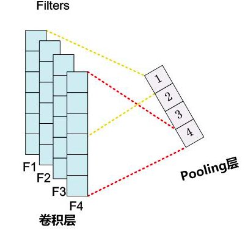

为提升计算性能，我们常常将不同长度的时序样本组成一个小批量，并通过在较短序列后附加特殊字符（如0）令批量中各时序样本长度相同。这些人为添加的特殊字符当然是无意义的。由于时序最大池化的主要目的是抓取时序中最重要的特征，它通常能使模型不受人为添加字符的影响。

* **TextCNN 模型**

TextCNN 模型主要使用了一维卷积层和时序最大池化层。假设输入的文本序列由  n  个词组成，每个词用  d  维的词向量表示。那么输入样本的宽为  n ，输入通道数为  d 。TextCNN 的计算主要分为以下几步。

1、定义多个一维卷积核，并使用这些卷积核对输入分别做卷积计算。宽度不同的卷积核可能会捕捉到不同个数的相邻词的相关性。

2、对输出的所有通道分别做时序最大池化，再将这些通道的池化输出值连结为向量。

3、通过全连接层将连结后的向量变换为有关各类别的输出。这一步可以使用丢弃层应对过拟合。

下图用一个例子解释了 TextCNN 的设计。这里的输入是一个有 11 个词的句子，每个词用 6 维词向量表示。因此输入序列的宽为 11，输入通道数为 6。给定 2 个一维卷积核，核宽分别为 2 和 4，输出通道数分别设为 4 和 5。因此，一维卷积计算后，4 个输出通道的宽为 11−2+1=10，而其他 5 个通道的宽为 11−4+1=8。尽管每个通道的宽不同，我们依然可以对各个通道做时序最大池化，并将 9 个通道的池化输出连结成一个 9 维向量。最终，使用全连接将 9 维向量变换为 2 维输出，即正面情感和负面情感的预测。

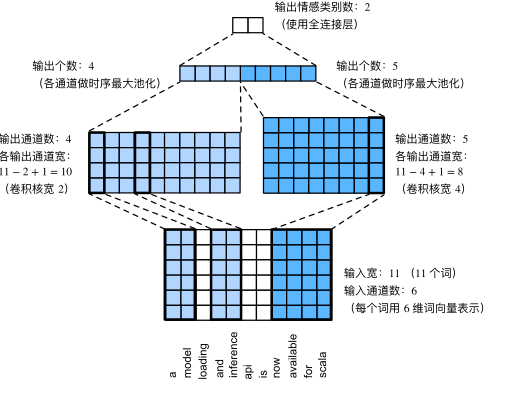

## 五、编码器—解码器（seq2seq）

解码器在各个时间步依赖相同的背景变量（context vector）来获取输⼊序列信息。当编码器为循环神经⽹络时，背景变量来⾃它最终时间步的隐藏状态。将源序列输入信息以循环单位状态编码，然后将其传递给解码器以生成目标序列。然而这种结构存在着问题，尤其是RNN机制实际中存在长程梯度消失的问题，对于较长的句子，我们很难寄希望于将输入的序列转化为定长的向量而保存所有的有效信息，所以随着所需翻译句子的长度的增加，这种结构的效果会显著下降。

与此同时，解码的目标词语可能只与原输入的部分词语有关，而并不是与所有的输入有关。例如，当把“Hello world”翻译成“Bonjour le monde”时，“Hello”映射成“Bonjour”，“world”映射成“monde”。在seq2seq模型中，解码器只能隐式地从编码器的最终状态中选择相应的信息。然而，注意力机制可以将这种选择过程显式地建模。

### 5.1、注意力机制框架

神经网络中的注意力机制（Attention Mechanism）是在计算能力有限的情况下，将计算资源分配给更重要的任务，同时解决信息超载问题的一种资源分配方案。
在神经网络学习中，一般而言模型的参数越多则模型的表达能力越强，模型所存储的信息量也越大，但这会带来信息过载的问题。那么通过引入注意力机制，在众多的输入信息中聚焦于对当前任务更为关键的信息，降低对其他信息的关注度，甚至过滤掉无关信息，就可以解决信息过载问题，并提高任务处理的效率和准确性。

用数学语言来表达这个思想就是：用X=[x_1, x_2, ..., x_N]表示N个输入信息，为了节省计算资源，不需要让神经网络处理这N个输入信息，而只需要从X中选择一些与任务相关的信息输进行计算。软性注意力（Soft Attention）机制是指在选择信息的时候，不是从N个信息中只选择1个，而是计算N个输入信息的加权平均，再输入到神经网络中计算。相对的，硬性注意力（Hard Attention）就是指选择输入序列某一个位置上的信息，比如随机选择一个信息或者选择概率最高的信息。但一般还是用软性注意力机制来处理神经网络的问题。

Attention 是一种通用的带权池化方法，输入由两部分构成：询问（query）和键值对（key-value pairs）。 ki∈Rdk,vi∈Rdv . Query  q∈Rdq  , attention layer得到输出与value的维度一致. 对于一个query来说，attention layer 会与每一个key计算注意力分数并进行权重的归一化，输出的向量 o 则是value的加权求和，而每个key计算的权重与value一一对应。

**5.1.1、普通模式** 

* **注意力分布**

把输入信息向量X看做是一个信息存储器，现在给定一个查询向量q，用来查找并选择X中的某些信息，那么就需要知道被选择信息的索引位置。采取“软性”选择机制，不是从存储的多个信息中只挑出一条信息来，而是雨露均沾，从所有的信息中都抽取一些，只不过最相关的信息抽取得就多一些。

于是定义一个注意力变量z\in [1, N]来表示被选择信息的索引位置，即z=i来表示选择了第i个输入信息，然后计算在给定了q和X的情况下，选择第i个输入信息的概率\alpha _i：

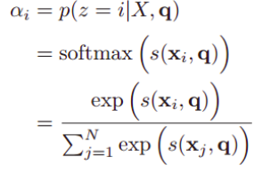

其中\alpha _i构成的概率向量就称为注意力分布（Attention Distribution）。s(x_i , q)是注意力打分函数，有以下几种形式：

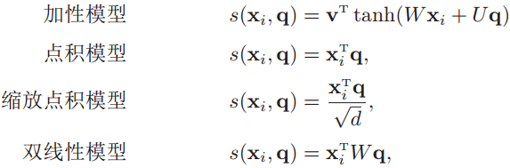

其中W、U和v是可学习的网络参数，d是输入信息的维度。

* **加权平均**

注意力分布\alpha _i表示在给定查询q时，输入信息向量X中第i个信息与查询q的相关程度。采用“软性”信息选择机制给出查询所得的结果，就是用加权平均的方式对输入信息进行汇总，得到Attention值：

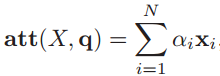

下图是计算Attention值的过程图：

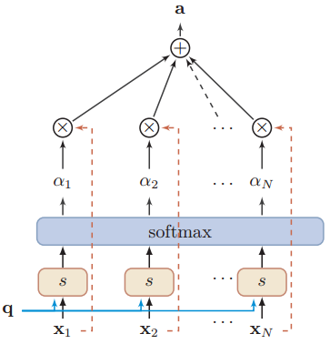

**5.1.2、键值对注意力模式**

更一般的，可以用键值对（key-value pair）来表示输入信息，那么N个输入信息就可以表示为（K, V）= [(k_1,v_1),(k_2,v_2),...,(k_N,v_N)](K, V)= [(k_1,v_1),(k_2,v_2),...,(k_N,v_N)]，其中“键”用来计算注意分布\alpha _i，“值”用来计算聚合信息。

那么就可以将注意力机制看做是一种软寻址操作：把输入信息X看做是存储器中存储的内容，元素由地址Key（键）和值Value组成，当前有个Key=Query的查询，目标是取出存储器中对应的Value值，即Attention值。而在软寻址中，并非需要硬性满足Key=Query的条件来取出存储信息，而是通过计算Query与存储器内元素的地址Key的相似度来决定，从对应的元素Value中取出多少内容。每个地址Key对应的Value值都会被抽取内容出来，然后求和，这就相当于由Query与Key的相似性来计算每个Value值的权重，然后对Value值进行加权求和。加权求和得到最终的Value值，也就是Attention值。

以上的计算可以归纳为三个过程：

* **根据Query和Key计算二者的相似度**

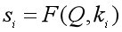

* **用softmax函数对注意力得分进行数值转换**

一方面可以进行归一化，得到所有权重系数之和为1的概率分布，另一方面可以用softmax函数的特性突出重要元素的权重；

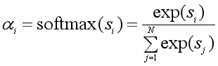

* **根据权重系数对Value进行加权求和**

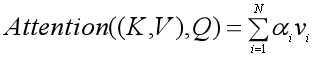

图示如下：

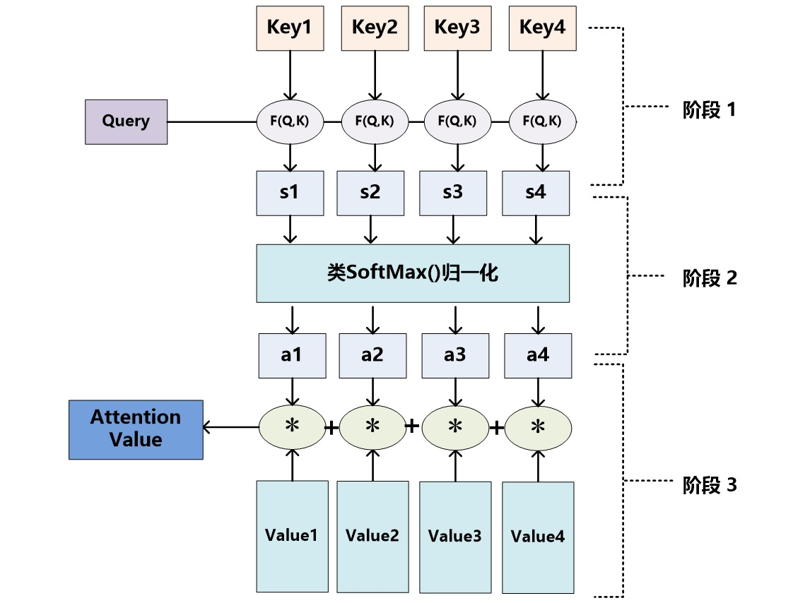

## 5.2、引入注意力机制的Seq2seq模型

本节中将注意机制添加到sequence to sequence 模型中，以显式地使用权重聚合states。下图展示encoding 和decoding的模型结构，在时间步为t的时候。此刻attention layer保存着encodering看到的所有信息——即encoding的每一步输出。在decoding阶段，解码器的 t 时刻的隐藏状态被当作query，encoder的每个时间步的hidden states作为key和value进行attention聚合. Attetion model的输出当作成上下文信息context vector，并与解码器输入 Dt 拼接起来一起送到解码器：

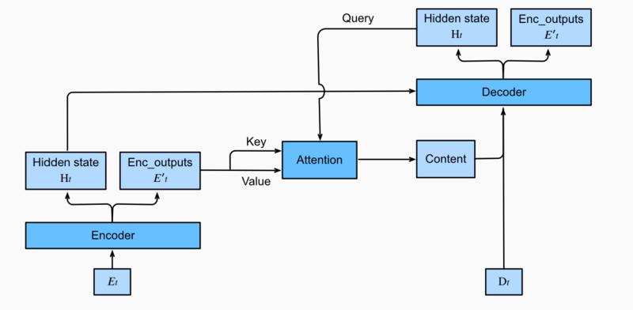

(1) Encoder方面接受的是每一个单词word embedding，和上一个时间点的hidden state。输出的是这个时间点的hidden state。

(2) Decoder方面接受的是目标句子里单词的word embedding，和上一个时间点的hidden state。

(3) context vector是一个对于encoder输出的hidden states的一个加权平均。

(4) 每一个encoder的hidden states对应的权重。

(5) 通过decoder的hidden states加上encoder的hidden states来计算一个分数，用于计算权重(4)

(6) 将context vector 和 decoder的hidden states 串起来。

(7) 计算最后的输出概率。

## 六、机器翻译

机器翻译（MT）：将一段文本从一种语言自动翻译为另一种语言，用神经网络解决这个问题通常称为神经机器翻译（NMT）。 主要特征：输出是单词序列而不是单个单词。 输出序列的长度可能与源序列的长度不同。