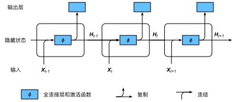
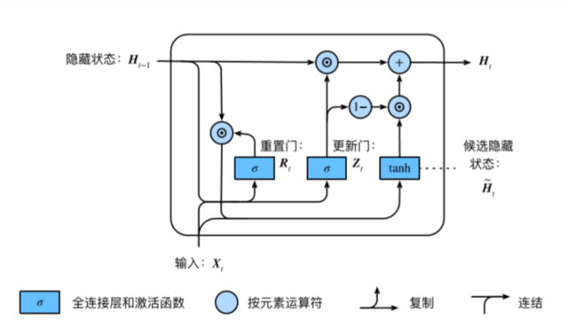
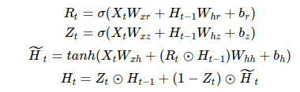
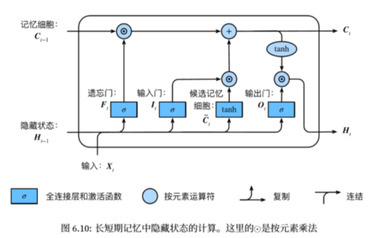
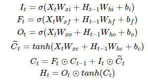
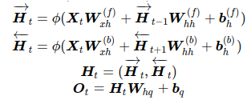

# 循环神经网络

。我们的目的是基于当前的输入与过去的输入序列，预测序列的下一个字符。循环神经网络引入一个隐藏变量 H ，用 Ht 表示 H 在时间步 t 的值。 Ht 的计算基于 Xt 和 Ht−1 ，可以认为 Ht 记录了到当前字符为止的序列信息，利用 Ht 对序列的下一个字符进行预测。

图1 含隐藏状态的循环神经网络

### 1、从零开始实现循环神经网络

* **裁剪梯度**

循环神经网络中较容易出现梯度衰减或梯度爆炸，这会导致网络几乎无法训练。裁剪梯度（clip gradient）是一种应对梯度爆炸的方法。假设我们把所有模型
参数的梯度拼接成一个向量  g ，并设裁剪的阈值是 θ 。裁剪后的梯度min(θ/∥g∥,1)*g的 L2 范数不超过 θ 。

* **困惑度**

我们通常使用困惑度（perplexity）来评价语言模型的好坏。回忆一下（softmax回归）中交叉熵损失函数的定义。困惑度是对交叉熵损失函数做指数运算后得到的值。特别地，

最佳情况下，模型总是把标签类别的概率预测为1，此时困惑度为1；

最坏情况下，模型总是把标签类别的概率预测为0，此时困惑度为正无穷；

基线情况下，模型总是预测所有类别的概率都相同，此时困惑度为类别个数。

显然，任何一个有效模型的困惑度必须小于类别个数。在本例中，困惑度必须小于词典大小vocab_size。

### 2、循环神经网络的简介实现

## 一、GRU

RNN存在的问题：梯度较容易出现衰减或爆炸（BPTT）

⻔控循环神经⽹络：捕捉时间序列中时间步距离较⼤的依赖关系

图2 GRU

• 重置⻔有助于捕捉时间序列⾥短期的依赖关系；

• 更新⻔有助于捕捉时间序列⾥⻓期的依赖关系。

## 二、LSTM

长短期记忆long short-term memory :

遗忘门:控制上一时间步的记忆细胞 输入门:控制当前时间步的输入

输出门:控制从记忆细胞到隐藏状态

记忆细胞：⼀种特殊的隐藏状态的信息的流动

图3 LSTM

## 三、双向循环神经网络

图4 双向循环神经网络

