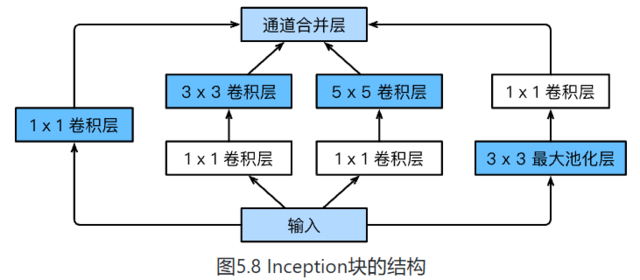
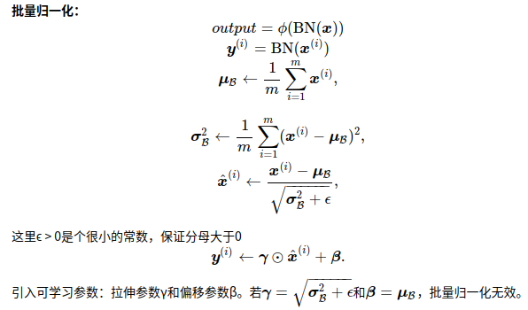
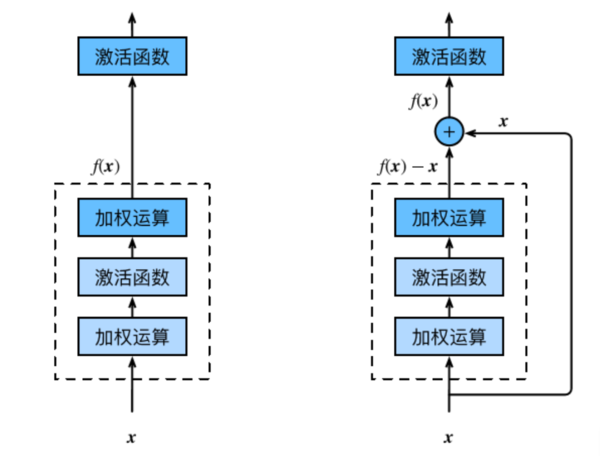
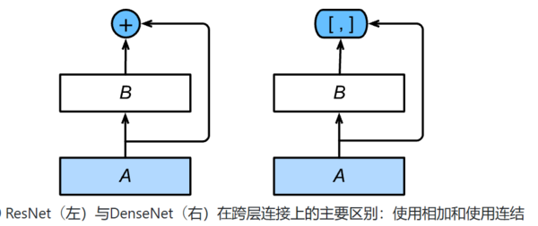

# 卷积神经网络

## 一、卷积层

**二维互相关运算**：二维互相关（cross-correlation）运算的输入是一个二维输入数组和一个二维核（kernel）数组，输出也是一个二维数组，其中核数组通常称为卷积核或过滤器（filter）。卷积核的尺寸通常小于输入数组，卷积核在输入数组上滑动，在每个位置上，卷积核与该位置处的输入子数组按元素相乘并求和，得到输出数组中相应位置的元素。

**互相关运算和卷积运算：**

卷积运算与互相关运算类似。为了得到卷积运算的输出，我们只需将核数组左右翻转并上下翻转，再与输入数组做互相关运算。可见，卷积运算和互相关运算虽然类似，但如果它们使用相同的核数组，对于同一个输入，输出往往并不相同。

卷积层为何能使用互相关运算替代卷积运算。其实，在深度学习中核数组都是学出来的：卷积层无论使用互相关运算或卷积运算都不影响模型预测时的输出。
如无特别说明，本书中提到的卷积运算均指互相关运算。

### 1、padding和stride

填充（padding）:是指在输入高和宽的两侧填充元素（通常是0元素）。

步幅（stride）:卷积窗口从输入数组的最左上方开始，按从左往右、从上往下的顺序，依次在输入数组上滑动。我们将每次滑动的行数和列数称为步幅（stride）。

### 2、多输入通道和多输出通道

卷积层与全连接层的对比：
二维卷积层经常用于处理图像，与此前的全连接层相比，它主要有两个优势：

一是全连接层把图像展平成一个向量，在输入图像上相邻的元素可能因为展平操作不再相邻，网络难以捕捉局部信息。而卷积层的设计，天然地具有提取局部信息的能力。

二是卷积层的参数量更少。

## 二、池化层

* 最大池化和平均池化分别取池化窗口中输入元素的最大值和平均值作为输出。

* 池化层的一个主要作用是缓解卷积层对位置的过度敏感性。

* 可以指定池化层的填充和步幅。

* 池化层的输出通道数跟输入通道数相同。

## 三、卷积神经网络（LeNet）

## 四、AlexNet

### 1、学习特征表示

### 2、AlexNet

AlexNet与LeNet的设计理念非常相似，但也有显著的区别。

第一，与相对较小的LeNet相比，AlexNet包含8层变换，其中有5层卷积和2层全连接隐藏层，以及1个全连接输出层。

第二，AlexNet将sigmoid激活函数改成了更加简单的ReLU激活函数。一方面，ReLU激活函数的计算更简单，例如它并没有sigmoid激活函数中的求幂运算。另一方面，ReLU激活函数在不同的参数初始化方法下使模型更容易训练。这是由于当sigmoid激活函数输出极接近0或1时，这些区域的梯度几乎为0，从而造成反向传播无法继续更新部分模型参数；而ReLU激活函数在正区间的梯度恒为1。因此，若模型参数初始化不当，sigmoid函数可能在正区间得到几乎为0的梯度，从而令模型无法得到有效训练。

第三，AlexNet通过丢弃法（参见“丢弃法”一节）来控制全连接层的模型复杂度。而LeNet并没有使用丢弃法。

第四，AlexNet引入了大量的图像增广，如翻转、裁剪和颜色变化，从而进一步扩大数据集来缓解过拟合。

## 五、VGG

### 1、VGG block

VGG块的组成规律是：连续使用数个相同的填充为1、窗口形状为3×3的卷积层后接上一个步幅为2、窗口形状为2×2的最大池化层。卷积层保持输入的高和宽不变，而池化层则对其减半。

### 2、VGG网络

与AlexNet和LeNet一样，VGG网络由卷积层模块后接全连接层模块构成。卷积层模块串联数个vgg_block，其超参数由变量conv_arch定义。该变量指定了每个VGG块里卷积层个数和输出通道数。全连接模块则跟AlexNet中的一样。

##六、网络中的网络（NiN）

LeNet、AlexNet和VGG在设计上的共同之处是：先以由卷积层构成的模块充分抽取空间特征，再以由全连接层构成的模块来输出分类结果。其中，AlexNet和VGG对LeNet的改进主要在于如何对这两个模块加宽（增加通道数）和加深。本节我们介绍网络中的网络（NiN）[1]。它提出了另外一个思路，即串联多个由卷积层和“全连接”层构成的小网络来构建一个深层网络。

### 1、NiN块

我们知道，卷积层的输入和输出通常是四维数组（样本，通道，高，宽），而全连接层的输入和输出则通常是二维数组（样本，特征）。如果想在全连接层后再接上卷积层，则需要将全连接层的输出变换为四维。回忆在“多输入通道和多输出通道”一节里介绍的1×1卷积层。它可以看成全连接层，其中空间维度（高和宽）上的每个元素相当于样本，通道相当于特征。因此，NiN使用1×1卷积层来替代全连接层，从而使空间信息能够自然传递到后面的层中去。

NiN块是NiN中的基础块。它由一个卷积层加两个充当全连接层的1×1卷积层串联而成。其中第一个卷积层的超参数可以自行设置，而第二和第三个卷积层的超参数一般是固定的。NiN块是NiN中的基础块。它由一个卷积层加两个充当全连接层的1×1卷积层串联而成。其中第一个卷积层的超参数可以自行设置，而第二和第三个卷积层的超参数一般是固定的。

**1×1卷积核作用**

1.放缩通道数：通过控制卷积核的数量达到通道数的放缩。

2.增加非线性。1×1卷积核的卷积过程相当于全连接层的计算过程，并且还加入了非线性激活函数，从而可以增加网络的非线性。

3.计算参数少

### 2、NiN模型

NiN是在AlexNet问世不久后提出的。它们的卷积层设定有类似之处。NiN使用卷积窗口形状分别为11×11、5×5和3×3的卷积层，相应的输出通道数也与AlexNet中的一致。每个NiN块后接一个步幅为2、窗口形状为3×3的最大池化层。

除使用NiN块以外，NiN还有一个设计与AlexNet显著不同：NiN去掉了AlexNet最后的3个全连接层，取而代之地，NiN使用了输出通道数等于标签类别数的NiN块，然后使用全局平均池化层对每个通道中所有元素求平均并直接用于分类。这里的全局平均池化层即窗口形状等于输入空间维形状的平均池化层。NiN的这个设计的好处是可以显著减小模型参数尺寸，从而缓解过拟合。然而，该设计有时会造成获得有效模型的训练时间的增加。

## 七、含并行连结的网络（GoogLeNet）

**由Inception基础块组成：**

Inception块相当于⼀个有4条线路的⼦⽹络。它通过不同窗口形状的卷积层和最⼤池化层来并⾏抽取信息，并使⽤1×1卷积层减少通道数从而降低模型复杂度。
可以⾃定义的超参数是每个层的输出通道数，我们以此来控制模型复杂度。

图2 Inception基础块组成

Inception块里有4条并行的线路。前3条线路使用窗口大小分别是1×1、3×3和5×5的卷积层来抽取不同空间尺寸下的信息，其中中间2个线路会对输入先做1×1卷积来减少输入通道数，以降低模型复杂度。第四条线路则使用3×3最大池化层，后接1×1卷积层来改变通道数。4条线路都使用了合适的填充来使输入与输出的高和宽一致。最后我们将每条线路的输出在通道维上连结，并输入接下来的层中去。

**GoogLeNet模型**

GoogLeNet跟VGG一样，在主体卷积部分中使用5个模块（block），每个模块之间使用步幅为2的3×3最大池化层来减小输出高宽。第一模块使用一个64通道的7×7卷积层。

第二模块使用2个卷积层：首先是64通道的1×1卷积层，然后是将通道增大3倍的3×3卷积层。它对应Inception块中的第二条线路。

第三模块串联2个完整的Inception块。第一个Inception块的输出通道数为64+128+32+32=256，其中4条线路的输出通道数比例为64:128:32:32=2:4:1:1。其中第二、第三条线路先分别将输入通道数减小至96/192=1/2和16/192=1/12后，再接上第二层卷积层。第二个Inception块输出通道数增至128+192+96+64=480，每条线路的输出通道数之比为128:192:96:64=4:6:3:2。其中第二、第三条线路先分别将输入通道数减小至128/256=1/2和32/256=1/8。

第四模块更加复杂。它串联了5个Inception块，其输出通道数分别是192+208+48+64=512、160+224+64+64=512、128+256+64+64=512、112+288+64+64=528和256+320+128+128=832。这些线路的通道数分配和第三模块中的类似，首先含3×3卷积层的第二条线路输出最多通道，其次是仅含1×1卷积层的第一条线路，之后是含5×5卷积层的第三条线路和含3×3最大池化层的第四条线路。其中第二、第三条线路都会先按比例减小通道数。这些比例在各个Inception块中都略有不同。

第五模块有输出通道数为256+320+128+128=832和384+384+128+128=1024的两个Inception块。其中每条线路的通道数的分配思路和第三、第四模块中的一致，只是在具体数值上有所不同。需要注意的是，第五模块的后面紧跟输出层，该模块同NiN一样使用全局平均池化层来将每个通道的高和宽变成1。最后我们将输出变成二维数组后接上一个输出个数为标签类别数的全连接层。

## 八、批量归一化（BatchNormalization）

我们对输入数据做了标准化处理：处理后的任意一个特征在数据集中所有样本上的均值为0、标准差为1。标准化处理输入数据使各个特征的分布相近：这往往更容易训练出有效的模型。

通常来说，数据标准化预处理对于浅层模型就足够有效了。随着模型训练的进行，当每层中参数更新时，靠近输出层的输出较难出现剧烈变化。但对深层神经网络来说，即使输入数据已做标准化，训练中模型参数的更新依然很容易造成靠近输出层输出的剧烈变化。这种计算数值的不稳定性通常令我们难以训练出有效的深度模型。

批量归一化的提出正是为了应对深度模型训练的挑战。在模型训练时，批量归一化利用小批量上的均值和标准差，不断调整神经网络中间输出，从而使整个神经网络在各层的中间输出的数值更稳定。

### 1、对全连接层做批量归一化

我们将批量归一化层置于全连接层中的仿射变换和激活函数之间。设全连接层的输入为u，权重参数和偏差参数分别为W和b，，激活函数为ϕ。设批量归一化的运算符为BN。那么，使用批量归一化的全连接层的输出为：ϕ(BN(x)),

其中批量归一化输入由x仿射变换x=Wu+b

### 2、对卷积层做批量归⼀化对

对卷积层来说，批量归一化发生在卷积计算之后、应用激活函数之前。如果卷积计算输出多个通道，我们需要对这些通道的输出分别做批量归一化，且每个通道都拥有独立的拉伸和偏移参数，并均为标量。设小批量中有 m个样本。在单个通道上，假设卷积计算输出的高和宽分别为 p和 q 。我们需要对该通道中 m×p×q个元素同时做批量归一化。对这些元素做标准化计算时，我们使用相同的均值和方差，即该通道中 m×p×q个元素的均值和方差。

使用批量归一化训练时，我们可以将批量大小设得大一点，从而使批量内样本的均值和方差的计算都较为准确。将训练好的模型用于预测时，我们希望模型对于任意输入都有确定的输出。因此，单个样本的输出不应取决于批量归一化所需要的随机小批量中的均值和方差。一种常用的方法是通过移动平均估算整个训练数据集的样本均值和方差，并在预测时使用它们得到确定的输出。可见，和丢弃层一样，批量归一化层在训练模式和预测模式下的计算结果也是不一样的。

## 九、残差网络（ResNet）

深度学习的问题：深度CNN网络达到一定深度后再一味地增加层数并不能带来进一步地分类性能提高，反而会招致网络收敛变得更慢，准确率也变得更差。

### 1、 残差块

ResNet沿用了VGG全3×3卷积层的设计。残差块里首先有2个有相同输出通道数的3×3卷积层。每个卷积层后接一个批量归一化层和ReLU激活函数。然后我们将输入跳过这两个卷积运算后直接加在最后的ReLU激活函数前。这样的设计要求两个卷积层的输出与输入形状一样，从而可以相加。如果想改变通道数，就需要引入一个额外的1×1卷积层来将输入变换成需要的形状后再做相加运算。

## 十、稠密连接网络（DenseNet）

图中将部分前后相邻的运算抽象为模块A和模块B。与ResNet的主要区别在于，DenseNet里模块B的输出不是像ResNet那样和模块A的输出相加，而是在通道维上连结。这样模块A的输出可以直接传入模块B后面的层。在这个设计里，模块A直接跟模块B后面的所有层连接在了一起。这也是它被称为“稠密连接”的原因。

DenseNet的主要构建模块是稠密块（dense block）和过渡层（transition layer）。前者定义了输入和输出是如何连结的，后者则用来控制通道数，使之不过大。

### 1、稠密块

卷积块的通道数控制了输出通道数相对于输入通道数的增长，因此也被称为增长率（growth rate）。

### 2、过渡层

每个稠密块都会带来通道数的增加，使用过多则会带来过于复杂的模型。过渡层用来控制模型复杂度。它通过1×1卷积层来减小通道数，并使用步幅为2的平均池化层减半高和宽，从而进一步降低模型复杂度。

