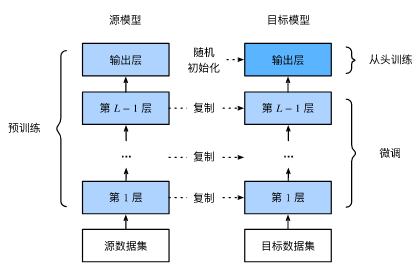
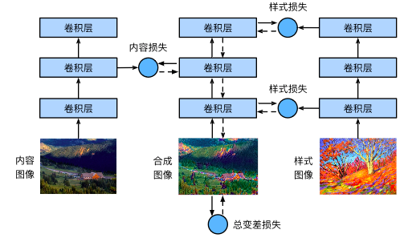
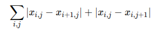

## 一、图像增广

图像增广（image augmentation）技术通过对训练图像做一系列随机改变，来产生相似但又不同的训练样本，从而扩大训练数据集的规模。图像增广的另一种解释是，随机改变训练样本可以降低模型对某些属性的依赖，从而提高模型的泛化能力。例如，我们可以对图像进行不同方式的裁剪，使感兴趣的物体出现在不同位置，从而减轻模型对物体出现位置的依赖性。我们也可以调整亮度、色彩等因素来降低模型对色彩的敏感度。可以说，在当年AlexNet的成功中，图像增广技术功不可没。本节我们将讨论这个在计算机视觉里被广泛使用的技术。

### 1.1、常用的图像增广方法

* 翻转和裁剪
* 变化颜色：可以从4个方面改变图像的颜色：亮度、对比度、饱和度和色调。

## 二、微调

1、在源数据集（如ImageNet数据集）上预训练一个神经网络模型，即源模型。

2、创建一个新的神经网络模型，即目标模型。它复制了源模型上除了输出层外的所有模型设计及其参数。我们假设这些模型参数包含了源数据集上学习到的知识，且这些知识同样适用于目标数据集。我们还假设源模型的输出层跟源数据集的标签紧密相关，因此在目标模型中不予采用。

3、为目标模型添加一个输出大小为目标数据集类别个数的输出层，并随机初始化该层的模型参数。

4、在目标数据集（如椅子数据集）上训练目标模型。我们将从头训练输出层，而其余层的参数都是基于源模型的参数微调得到的。

当目标数据集远小于源数据集时，微调有助于提升模型的泛化能力。

## 三、目标检测

## 四、风格迁移

首先，我们初始化合成图像，例如将其初始化成内容图像。该合成图像是样式迁移过程中唯一需要更新的变量，即样式迁移所需迭代的模型参数。然后，我们选择一个预训练的卷积神经网络来抽取图像的特征，其中的模型参数在训练中无须更新。深度卷积神经网络凭借多个层逐级抽取图像的特征。我们可以选择其中某些层的输出作为内容特征或样式特征。以图9.13为例，这里选取的预训练的神经网络含有3个卷积层，其中第二层输出图像的内容特征，而第一层和第三层的输出被作为图像的样式特征。接下来，我们通过正向传播（实线箭头方向）计算样式迁移的损失函数，并通过反向传播（虚线箭头方向）迭代模型参数，即不断更新合成图像。样式迁移常用的损失函数由3部分组成：内容损失（content loss）使合成图像与内容图像在内容特征上接近，样式损失（style loss）令合成图像与样式图像在样式特征上接近，而总变差损失（total variation loss）则有助于减少合成图像中的噪点。最后，当模型训练结束时，我们输出样式迁移的模型参数，即得到最终的合成图像。

**内容损失：** 与线性回归中的损失函数类似，内容损失通过平方误差函数衡量合成图像与内容图像在内容特征上的差异。

**样式损失：** 样式损失也一样通过平方误差函数衡量合成图像与样式图像在样式上的差异。为了表达样式层输出的样式，我们先通过extract_features函数计算样式层的输出。假设该输出的样本数为1，通道数为 c ，高和宽分别为 h 和 w ，我们可以把输出变换成 c 行 hw 列的矩阵 X 。矩阵 X 可以看作是由 c 个长度为 hw 的向量 x1,…,xc 组成的。其中向量 xi 代表了通道 i 上的样式特征。这些向量的格拉姆矩阵（Gram matrix） XX⊤∈Rc×c 中 i 行 j 列的元素 xij 即向量 xi 与 xj 的内积，它表达了通道 i 和通道 j 上样式特征的相关性。我们用这样的格拉姆矩阵表达样式层输出的样式。需要注意的是，当 hw 的值较大时，格拉姆矩阵中的元素容易出现较大的值。此外，格拉姆矩阵的高和宽皆为通道数 c 。为了让样式损失不受这些值的大小影响，下面定义的gram函数将格拉姆矩阵除以了矩阵中元素的个数，即 chw 。

**总变差损失：** 有时候，我们学到的合成图像里面有大量高频噪点，即有特别亮或者特别暗的颗粒像素。一种常用的降噪方法是总变差降噪（total variation denoising）。假设 xi,j 表示坐标为 (i,j) 的像素值，降低总变差损失

样式迁移的损失函数即内容损失、样式损失和总变差损失的加权和。通过调节这些权值超参数，我们可以权衡合成图像在保留内容、迁移样式以及降噪三方面的相对重要性。

## 五、GAN

### 5.1、简介

    1）、生成对抗网络由Goodfellow在2014年提出。其主要灵感来源于博弈论中零和博弈的思想。GAN由生成器和判别器组成。生成器的功能是输入一个样本将其输出成一个逼真的样子，判别器来判断输入的样本是真的还是伪造的。

    2）、判别网络的目的：就是能判别出来属于的一张图它是来自真实样本集还是假样本集。例如输入的是真样本，网络输出就接近1，输出的是假样本，网络输出接近0。

    3）、生成网络的目的：生成网络是造样本，它的目的就是使得自己造样本的能力尽可能强，强到什么程度呢，判别网络没法判断我是真样本还是假样本。

### 5.2、GAN 的特点及优缺点：

**特点：**

    1）、 相比较传统的模型，他存在两个不同的网络，而不是单一的网络，并且训练方式采用的是对抗训练方式

    2）、GAN中G的梯度更新信息来自判别器D，而不是来自数据样本

**优点（摘自ian goodfellow 在Quora的问答）**
  
    1）、GAN是一种生成式模型，相比较其他生成模型（玻尔兹曼机和GSNs）只用到了反向传播,而不需要复杂的马尔科夫链
  
    2）、 相比其他所有模型, GAN可以产生更加清晰，真实的样本
  
    3）、GAN采用的是一种无监督的学习方式训练，可以被广泛用在无监督学习和半监督学习领域

其余更多优点可以参考博客

### 5.3、GAN的广泛应用
    
      1）、GAN本身是一种生成式模型，所以在数据生成上用的是最普遍的，最常见的是图片生成，常用的有DCGAN WGAN，BEGAN。
    
      2）、GAN可以和强化学习结合，目前一个比较好的例子就是seq-GAN
    
      3）、GAN可以和强化学习结合，目前一个比较好的例子就是seq-GAN
    
      4）、目前比较有意思的应用就是GAN用在图像风格迁移，图像降噪修复，图像超分辨率了，都有比较好的结果。

### 5.4、GAN的变种

自从GAN出世后，得到了广泛研究，先后几百篇不同的GANpaper横空出世，国外有大神整理了一个GAN zoo（GAN动物园），链接如下，感兴趣的可以参考一下：https://github.com/hindupuravinash/the-gan-zoo

